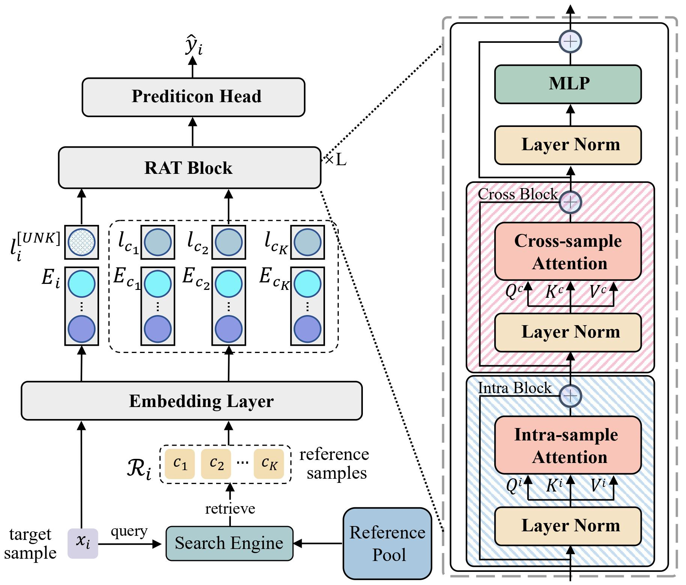

# RAT: Retrieval-Augmented Transformer for Click-Through Rate Prediction

This repository is the official PyTorch implementation of our WWW 2024 short paper.


## Catalogue <br> 
* [1. Getting Started](#getting-started)
* [2. Train/Test](#train/Test)
* [3. Trained Models](#trained-models)
* [4. Results](#results)
* [5. Citation](#citation)

## Getting Started

1\. Clone this repository:
```
git clone https://github.com/YushenLi807/RAT.git
cd RAT
```

2\. Install the dependencies:
- cuda 11.7
- python 3.7.8
- pytorch 1.13.1
- numpy 1.21.6
- h5py 2.10.0
```
pip install -r requirements.txt
```

3\. Download Datasets: Tmall_002 is the full dataset of Tmall. You can download them from Baiduyun disk. 

| *Dataset* | *Link* |
| ---- | ---- |
| Movielenslatest | [Baidu disk](https://pan.baidu.com/s/1FINlfaFxZr00H9Ma8eOgiw?pwd=0000) |
| Movielenslatest_10fold_retrieval | [Baidu disk](https://pan.baidu.com/s/1-Kmud4GQtdDL3KPnl9sHfA?pwd=0000) |
| KKBox | [Baidu disk](https://pan.baidu.com/s/1UTrlgoWNWBVkDtkbkeVnVg?pwd=0000) |
| KKBox_10fold_retrieval | [Baidu disk](https://pan.baidu.com/s/1TupRBIMACzDw-1eXEivHEg?pwd=0000) |
| Tmall | [Baidu disk](https://pan.baidu.com/s/1apFCDYp_mgPbhxrb1DXW6A?pwd=0000) |
| Tmall_002 | [Baidu disk](https://pan.baidu.com/s/1GBOJEihUlOMMPfRSyhUdQg?pwd=0000) |
| Tmall_002_retrieval | [Baidu disk](https://pan.baidu.com/s/1Qwy4bo_pVLXtaE5easLnEg?pwd=0000) |


## Train/Test
RAT_m0:RAT<sub>JM</sub>.

RAT_m1:RAT<sub>CE</sub>.

RAT_m2:The default RAT.

RAT_m3:RAT<sub>PA</sub>.

To train/test RAT on Movielenslatest_10fold_retrieval:
```
python run_expid.py --config ./configs/RAT_m2/movielenslatest_x1 --expid RAT_m2_movielenslatest_x1_10fold_retrieval --gpu 0
```

To train/test RAT on KKBox_10fold_retrieval:
```
python run_expid.py --config ./configs/RAT_m2/kkbox_x1 --expid  RAT_m2_kkbox_x1_10fold_retrieval --gpu 0
```

To train/test RAT on Tmall_002_retrieval:
```
python run_expid.py --config ./configs/RAT_m2/tmall_x1_002 --expid  RAT_m2_tmall_x1_002_retrieval --gpu 0
```

## Trained Models

We provide trained RAT checkpoints. You can download them from Baiduyun disk.

| *Dataset* | *Link* |
| ---- | ---- |
| Movielenslatest_10fold_retrieval | [Baidu disk](https://pan.baidu.com/s/1Y6PcI4oxdEt_VT6pVZ31cg?pwd=0000) |
| KKBox_10fold_retrieval | [Baidu disk](https://pan.baidu.com/s/1ANvK91PC0Dp1NLQsCMfzCg?pwd=0000) |
| Tmall_002_retrieval | [Baidu disk](https://pan.baidu.com/s/1aII61WjlZ3apnY7zUj35zA?pwd=0000) |

## Results
For this repository, the expected performance is:

<table>
<thead>
  <tr>
    <th rowspan="2">Model</th>
    <th colspan="2">ML-Tag</th>
    <th colspan="2">KKBox</th>
    <th colspan="2">Tmall</th>
  </tr>
  <tr>
    <th>AUC</th>
    <th>Logloss</th>
    <th>AUC</th>
    <th>Logloss</th>
    <th>AUC</th>
    <th>Logloss</th>
  </tr>
</thead>
<tbody>
  <tr>
    <td> RAT<sub>JM</sub> </td>
    <td> 0.9667 </td>
    <td> 0.2003 </td>
    <td> 0.8415 </td>
    <td> 0.4917 </td>
    <td> 0.9581 </td>
    <td> 0.3110 </td>
  </tr>
    <tr>
    <td> RAT<sub>CE</sub> </td>
    <td> 0.9736 </td>
    <td> 0.1731 </td>
    <td> 0.8483 </td>
    <td> 0.4831 </td>
    <td> 0.9575 </td>
    <td> 0.3182 </td>
  </tr>
    <tr>
    <td> RAT<sub>PA</sub> </td>
    <td> 0.9777 </td>
    <td> 0.1557 </td>
    <td> 0.8484 </td>
    <td> 0.4828 </td>
    <td> 0.9582 </td>
    <td> 0.3177 </td>
  </tr>
    <tr>
    <td> <b>RAT</b> </td>
    <td> <b>0.9809</b> </td>
    <td> <b>0.1421</b> </td>
    <td> <b>0.8500 </b> </td>
    <td> <b>0.4812 </b> </td>
    <td> <b>0.9589</b> </td>
    <td> <b>0.3091</b> </td>
  </tr>
</tbody>
</table>


## Citation

If you find this repository useful, please consider citing our work:

```
@inproceedings{li2024rat,
  title={RAT: Retrieval-augmented Transformer for Click-through Rate Prediction},
  author={Yushen Li and Jinpeng Wang and Tao Dai and Jieming Zhu and Jun Yuan and Rui Zhang and Shu-Tao Xia},
  booktitle={Companion Proceedings of the ACM Web Conference 2024},
  year={2024}
}
```

## Acknowledgements
Our code is based on the implementation of [FuxiCTR] and [BARS].

[FuxiCTR]:https://github.com/reczoo/FuxiCTR
[BARS]:https://github.com/reczoo/BARS
